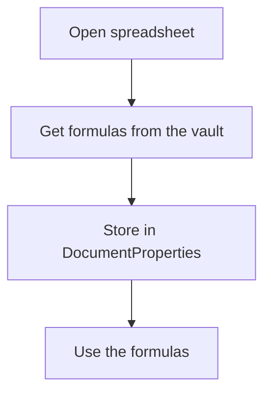

# John Doe

Every time client opens their spreadsheet:



## Apps Script configuration

- **Apps Script -> Project Settings -> Script Properties**:

   ```text
   {
     VAULT_URL: <web app url of the vault>,
     ACCESS_KEY: <to authorize the request>
   }
   ```

- **`appsscript.json`**:

  ```json
  {
    "oauthScopes": [
      "https://www.googleapis.com/auth/spreadsheets",
      "https://www.googleapis.com/auth/script.external_request",
      "https://www.googleapis.com/auth/script.scriptapp"
    ]
  }
  ```
