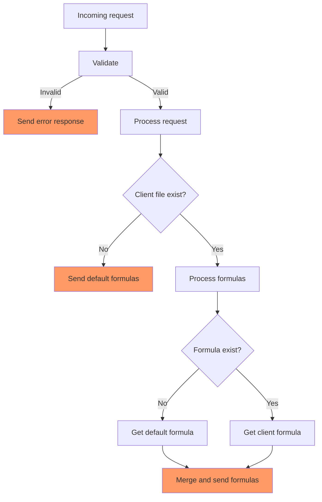

# Function Vault

## Overview

This project extends [Apps Script Management](https://github.com/sangnandar/Apps-Script-Management) in the case where clients have their own unique variables and/or functions.

Consider this scenario:

- There are John Doe and Jane Smith.

- Function `customFormulaOne` for cell A7 accepted 2 arguments:

  ```js
  function customFormulaOne(a, b)
  {
    return a + (coefficient * b);
  }
  ```

- John Doe and Jane Smith calculate `coefficient` differently. Let's say John Doe and Jane Smith have different sets of data resulted in a different method to calculate the coefficient.

- Hence we need to write different `customFormulaOne` for John Doe and Jane Smith.

## The Vault

We need to create a vault that follows this structure:

```text
/vault
│── Default.gs          # Default formulas applied for all clients.
│── John Doe.gs         # Unique formulas applied only for John Doe.
│── Jane Smith.gs       # Unique formulas applied only for Jane Smith.
└── ...etc...
```

## Send formulas

When the vault receives an incoming request:



## Apps Script configuration

- **`appsscript.json`**:

  ```json
  {
    "webapp": {
      "executeAs": "USER_DEPLOYING",
      "access": "ANYONE_ANONYMOUS"
    }
  }
  ```

## Sheets configuration

**DO NOT** change sheets name, delete columns, or re-arrange columns for the following ranges:

- Read

  ```text
  'Updater'!A2:G
  ```

Sheets layout:

  

